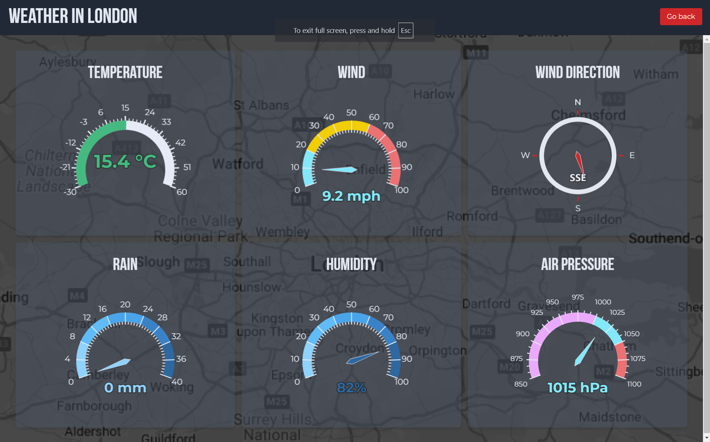

# Next.js Weather app

This application is a current weather information app built using Next.js, where users can view the live weather conditions for a selected location. A key highlight is the use of Server-side rendering (SSR), which allows the app to fetch weather data dynamically from external APIs, ensuring that content is delivered quickly and optimized for performance and SEO.

Throughout the development, several important features were implemented:

* Next.js: The app utilizes Next.js for server-side rendering and dynamic routing, providing a fast, reliable user experience.
* Tailwind CSS: Tailwind CSS is applied to ensure a responsive and modern design across different screen sizes, making the app visually appealing and user-friendly.
* Google Maps API: Integrated the Google Maps API to display an interactive map of the selected location, allowing users to see their weather in a geographical context.
* Error Handling and Fallbacks: Set up robust error handling to provide fallback content (like default maps) when issues with API calls occur.



This is a [Next.js](https://nextjs.org) project bootstrapped with [`create-next-app`](https://nextjs.org/docs/app/api-reference/cli/create-next-app).

## Getting Started

First, run the development server:

```bash
npm run dev
# or
yarn dev
# or
pnpm dev
# or
bun dev
```

Open [http://localhost:3000](http://localhost:3000) with your browser to see the result.

You can start editing the page by modifying `app/page.tsx`. The page auto-updates as you edit the file.

This project uses [`next/font`](https://nextjs.org/docs/app/building-your-application/optimizing/fonts) to automatically optimize and load [Geist](https://vercel.com/font), a new font family for Vercel.

## Learn More

To learn more about Next.js, take a look at the following resources:

- [Next.js Documentation](https://nextjs.org/docs) - learn about Next.js features and API.
- [Learn Next.js](https://nextjs.org/learn) - an interactive Next.js tutorial.

You can check out [the Next.js GitHub repository](https://github.com/vercel/next.js) - your feedback and contributions are welcome!

## Deploy on Vercel

The easiest way to deploy your Next.js app is to use the [Vercel Platform](https://vercel.com/new?utm_medium=default-template&filter=next.js&utm_source=create-next-app&utm_campaign=create-next-app-readme) from the creators of Next.js.

Check out our [Next.js deployment documentation](https://nextjs.org/docs/app/building-your-application/deploying) for more details.
